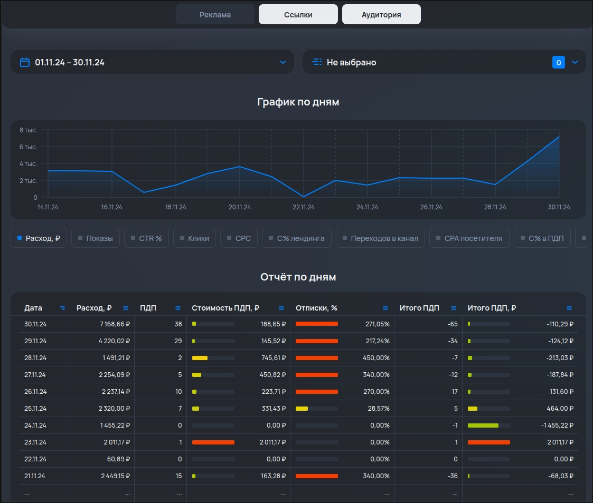

# Telegram WebApp Analytics

A Telegram WebApp for viewing and analyzing advertising campaign performance metrics. Built with modern web technologies, it provides a user-friendly interface for tracking and visualizing campaign data within Telegram.

## Features
- Real-time analytics for advertising campaigns.
- Interactive dashboards with key metrics.
- Seamless integration with Telegram's WebApp ecosystem.
- Responsive design for mobile and desktop.

## Tech Stack
- **Frontend**: React
- **Backend**: Hono, GrammyJS
- **Other**: Telegram WebApp API
